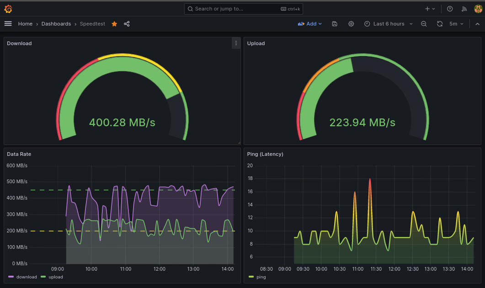

# internet-health-monitor
Docker stack for monitoring internet quality with dashboards.

Works with x86-64 and ARM64 architectures;

# Logger
- Internet speed testing using cli;
- Alpine container that will trigger the speedtest-cli tool and log test results;
- Scheduled on CRON to run every 5 mins;
- Output will be logged as json in logger_output folder;

# Database
This project uses Postgres as the default database, but any compatible relational database would work.

- Postgres container based in Debian 12;
- Using PostgreSQL 15;
- Persist logged data;

# Data Cleaning
Automated data handling/cleaning using python.

- Python 3.11 default container image;
- Scheduled on CRON to run every 5 mins;
- Get download, upload and ping(latency) attributes;
- Monitors the output folder for new logs;
- Reads the logs and parse the data cleaning it;
- Stores the clean data into the database;
- Removes the logged file;

# UI - Dashboard
Using [Grafana](https://grafana.com/) to enable custom dashboards.

- Simple UI to query and show logged data in a simple dashboard;
- Using Grafa na default container;

# ToDos
- Persist default grafana dashboard;
- Use EnvVars to set database on Data Cleaning container;

# Requirements

- Docker 22+
- Docker Compose 1.29.2+

# Usage example

On the project's root directory:

    docker-compose up -d

Access the Dashboard

    localhost:3000/

Configure data source:

Customize at will!

Data example:

